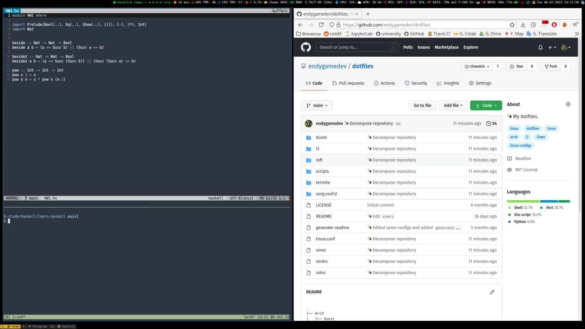

```
     _       _    __ _ _           
  __| | ___ | |_ / _(_) | ___  ___ 
 / _` |/ _ \| __| |_| | |/ _ \/ __|
| (_| | (_) | |_|  _| | |  __/\__ \
 \__,_|\___/ \__|_| |_|_|\___||___/

# Another dotfiles repo v1.0
```

---



---

|                           |                                                       |
|---------------------------|-------------------------------------------------------|
| **Shell:**                | [zsh](https://github.com/ohmyzsh/ohmyzsh)             |
| **WM:**                   | [i3](https://github.com/i3/i3)                        |
| **Editor:**               | [vim](https://github.com/vim/vim)                     |
| **Terminal:**             | [termite](https://github.com/thestinger/termite)      |
| **Launcher:**             | [rofi](https://github.com/davatorium/rofi)            |
| **Browser:**              | [firefox](https://www.mozilla.org/en-US/firefox/new/) |
| **Notification Manager:** | [dunst](https://github.com/dunst-project/dunst)       |

---

### zsh
Dependencies:
1. [zsh-syntax-highlighting](https://github.com/zsh-users/zsh-syntax-highlighting)
1. [zsh-autocomplete](https://github.com/marlonrichert/zsh-autocomplete)
1. [colorls](https://github.com/athityakumar/colorls)

Theme:  
[lambda-minimal-theme](https://github.com/sohnryang/lambda-minimal-theme)

---

### vim
Dependencies:
1. [Vundle.vim](https://github.com/VundleVim/Vundle.vim)
1. [conoline.vim](https://github.com/miyakogi/conoline.vim)
1. [NERDTree](https://github.com/preservim/nerdtree)
1. [NERD Commenter](https://github.com/preservim/nerdcommenter)
1. [Powerline](https://github.com/powerline/powerline)
1. [vim-airline](https://github.com/vim-airline/vim-airline)
1. [vim-airline-themes](https://github.com/vim-airline/vim-airline-themes)
1. [vim-emoji](https://github.com/junegunn/vim-emoji)
1. [markdown-preview.nvim](https://github.com/iamcco/markdown-preview.nvim)
1. [syntastic](https://github.com/vim-syntastic/syntastic)

Theme:  
[nord-vim](https://github.com/arcticicestudio/nord-vim)

---

### termite
Theme:  
[nord-termite](https://github.com/arcticicestudio/nord-termite)

Font:  
[nerdfonts.com/DejaVuSansMono Nerd Font](https://www.nerdfonts.com/font-downloads)

---

### rofi
Theme:
[nord-rofi-theme](https://github.com/undiabler/nord-rofi-theme)

---

### dunst
No dependencies  
See all settings in the [source code](./src/dunst/dunstrc)

---

### tmux
No dependencies  
See all settings in the [source code](./src/tmux.conf)

---

### i3
Some scripts were taken from [vivien/i3blocks](https://github.com/vivien/i3blocks)

---

### firefox
I just applied a custom font to all sites — [Fira Sans](https://fonts.google.com/specimen/Fira+Sans)
